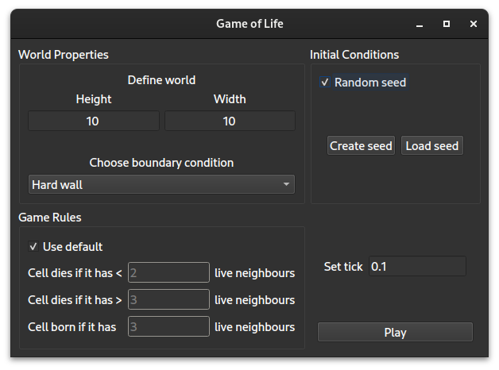
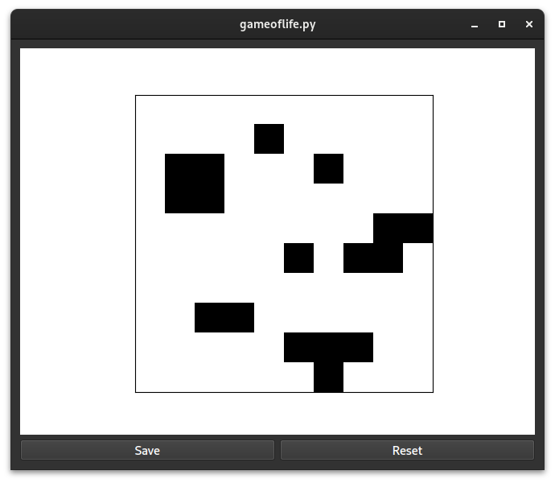

# Game of Life

## A Python program for simulating Conway's Game of Life

### Setup
```bash
$ git clone https://github.com/dc2917/GameOfLife
$ cd GameOfLife
$ python -m venv .venv
$ source .venv/bin/activate
$ pip install -r requirements.txt
```

### Usage
```bash
$ python gameoflife.py
```



The main configuration window allows you to set the height and width of the world. The choice of boundary condition sets what happens to grid cells at the edge of the world.

You can also set the game rules. By default, a live cell dies if it has less than two or more than 3 live neighbours, and a dead cell is born if it has exactly three live neighbours. You have the freedom to change these and see how it affects the course of the game.

The initial state, i.e. the distribution of live and dead cells, can be randomly generated. Alternatively, you can create an initial state by (de)selecting individual cells.



Initial states can be saved to and loaded from files.

The tick length is the (minimum) real time between steps in the game.
