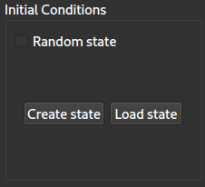

Game of Life's documentation
============================

Game of Life is a cellular automaton devised by the British mathematician John Conway in 1970 [1]_ . It is a zero-player game, meaning that its evolution is determined by its initial state, requiring no further input. One interacts with the game by creating an initial configuration and observing how it evolves.

In the Game of Life, the world is a two-dimensional grid, the cells of which each exist in one of two states - dead or alive. In each iteration of the game, the world evolves as the state of each cell changes. The state of each cell is determined by those of its eight neighbours:

* Any live cell with fewer than two live neighbours dies
* Any live cell with more than three live neighbours dies
* Any live cell with two or three live neighbours lives on to the next generation
* Any dead cell with exactly three live neighbours becomes live.

The main configuration window allows you to customise the world and how it evolves:

You can create a uniform-randomly generated initial state, create one from scratch or load a saved state:

You can set the size of the world grid, and what happens at the edges of the grid, i.e. the boundary conditions:

* Open: the world is effectively infinite, spanning beyond the visible grid
* Hard-wall: the world is finite, and nothing happens outside the visible grid
* Periodic: the world effectively wraps around on itself, connecting the top with bottom and left with right

You can customise the rules, specifying how many live neighbours a cell requires to change state:

You can also set the speed of the game by changing the "tick", i.e. the time between iterations.

.. [1] https://en.wikipedia.org/wiki/Conway%27s_Game_of_Life

API documentation
=================

.. toctree::
   :maxdepth: 2
   :caption: Contents:

   modules

Indices and tables
==================

* :ref:`genindex`
* :ref:`modindex`
* :ref:`search`
